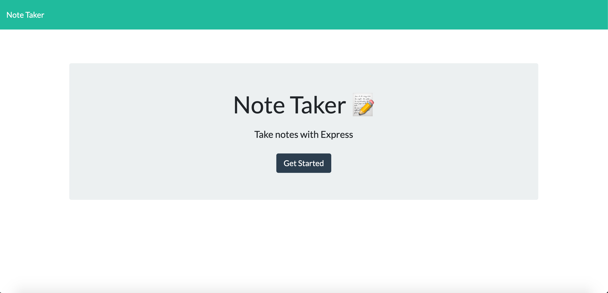
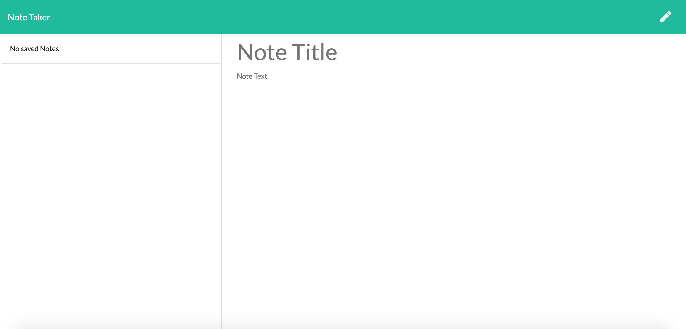
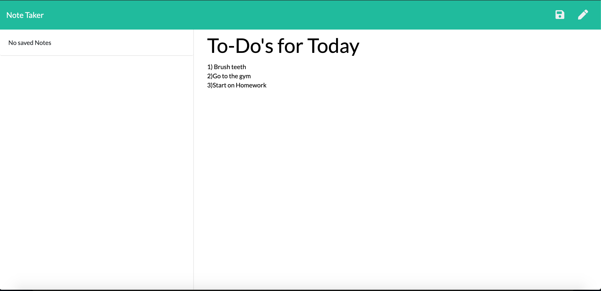
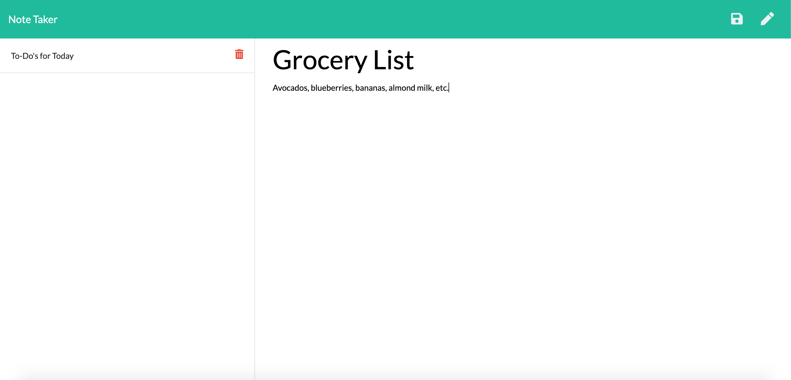

# Note-Taker

## Description
This app allows the user to make notes for themselves as well as being able to edit and delete them thoughout the day.
## Table of Contents
    
* [Installation](#installation)
* [Usage](#usage)
* [License](#license)

## Installation

Just follow the link to the deployed Heroku app!
* Heroku App: https://vast-waters-32739.herokuapp.com/

## Usage

First the user must click on the Get Started button.

The user is then directed to a page where they can create a note with a Title and Body.
 
After saving the note, the user can access it using the side bar.

A new note can be made after that, allowing the user to keep on creating and deleting notes as they please. 

## License

This app does not currently have a license.

## Contributing

Suggestions and contributions can be made via email or by creating an issue in the Github repository.
* Email: elsadan96340@gmail.com
* Github username: maquispe
* Github repository link: https://github.com/maquispe/Note-Taker
    
## Questions

Questions are always welcome via email.